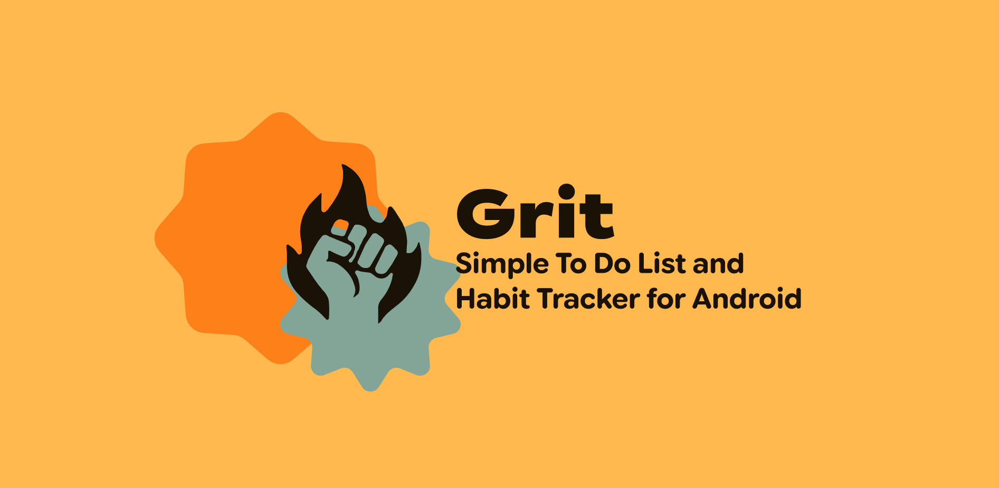

# Ἕξις ⟹ Ἀρετή




## Features

- [x] Todo List with reminders
- [x] Daily Habit Tracking
- [x] Analytics with Habit Maps
- [x] Notification Reminders
- [x] Widgets

## Contributing

Please read [CONTRIBUTING.md](CONTRIBUTING.md) for details on our code of conduct, and the process for submitting pull requests.

# Building from Source

## Prerequisites

- JDK 21
- Android SDK (compileSdk 37 / targetSdk 37)
- Android Studio (recommended) or Gradle 9.5.1+

## Build a Release APK

```shell
# FOSS variant (no Google Play dependencies)
./gradlew assembleFossRelease

# Play variant (requires RevenueCat API key)
./gradlew assemblePlayRelease
```

On Windows:

```bat
gradlew.bat assembleFossRelease
```

The APK will be at `androidApp/build/outputs/apk/foss/release/`.

## Signing

Grit's CI signs builds via injected Gradle properties. To sign locally, create a keystore and pass:

```shell
./gradlew assembleFossRelease \
  -Pandroid.injected.signing.store.file=/path/to/keystore.jks \
  -Pandroid.injected.signing.store.password=storepass \
  -Pandroid.injected.signing.key.alias=key0 \
  -Pandroid.injected.signing.key.password=keypass
```

After signing, verify the APK matches the official signing certificate fingerprint listed below.

