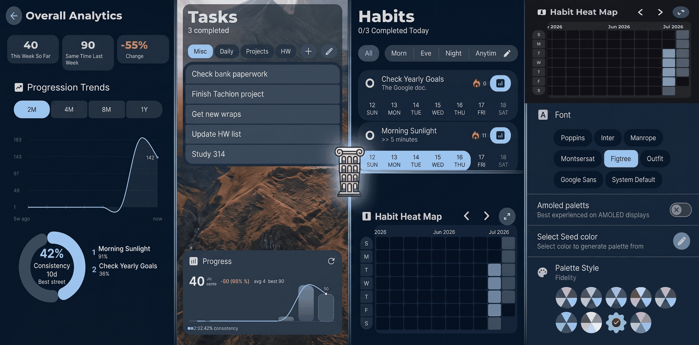

# Ἕξις ⟹ Ἀρετή


Hexis is a Kotlin app that's both pleasant to use and functional. I made this app in hopes of improving my own habits, since none of the other habit trackers were comprehensive enough for me. I also wanted to try out some new ideas. The inspiration for the app is from the cliché saying of "Excellence is not an act but a habit", inspired from Aristotle. The word he uses for habit is "Ἕξις", which is pronounced "Hexis", and so that was the inspiration for this app. It's supposed to be the habit builder that helps you lead yourself to excellence, Ἀρετή.

## Features



- Habit tracking: binary and quantity-based, pomodoro-linked, with reminders.
- Tasks with categories, pomodoro timer, and filtering.
- Notes: write notes in the `Tasks` app to keep up with protocols and more.
- Analytics: streaks, weekly charts, heat maps, consistency scores.
- Widgets: habit overview, streak display, week chart, progress analytics, all tasks.
- Backup and restore, Material You theming, 8 font options.
- No ads, trackers, limitations, or anything of that sort.

The goal with most of these features was to bring in the most excellent version of all of the features I've seen of the few different habit trackers that I've tried, in addition to some of the custom things I personally need.

## Usage

>Note that, for now, Hexis is Android-only. If I get enough request, I'll consider making a iOS version.

### Download

Download the latest APK from the [release page](https://github.com/intelligent-username/hexis/releases).

Find the file you downloaded and click on it to run it. Android will prompt with a security warning since we're not downloading from the Play Store. Just click on "Install Anyway" and you should be good to go.

### Build from source

If you want to modify the app and build it yourself, take the following steps. Note that you can't download the APK(s) that I've uploaded and then update them with your own build since the signing keys are different (for security reasons), if you try to download anyway it'll create two versions of the same app.

#### Prerequisites

- JDK 21
- Android SDK (compileSdk 37 / targetSdk 37)
- Android Studio or Gradle 9.5.1+

#### Generate the APK

```shell
./gradlew assembleRelease
```

On Windows:

```bat
gradlew.bat assembleRelease
```

The APK lands at `androidApp/build/outputs/apk/release/`.

## Signing and updates

Running `./gradlew assembleRelease` compiles the app and signs it with a debug key. Android requires that app updates use the same signing key as the installed version. The official keystore is private, so any build from source will have a different signature than the GitHub releases.

To sideload your own build on a device with the official app installed, uninstall the official version first. Use the in-app backup feature to save your data before uninstalling.

Want your own signature? Create a keystore and pass it to Gradle:

```shell
./gradlew assembleRelease \
  -Pandroid.injected.signing.store.file=/path/to/keystore.jks \
  -Pandroid.injected.signing.store.password=storepass \
  -Pandroid.injected.signing.key.alias=key0 \
  -Pandroid.injected.signing.key.password=keypass
```

## Contributing

See [CONTRIBUTING.md](CONTRIBUTING.md) for the code of conduct and pull request process.

This project is licensed under the GNU General Public License v3.0. See [LICENSE](LICENSE) for more information.
